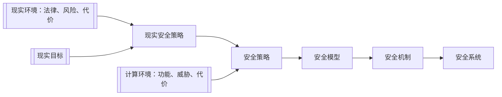

# 课前须知

> 课程主页：[瀚海教学网](https://course.ustc.edu.cn/portal)

- 成绩组成
  > - [x] 期末考试（闭卷，预计第14周左右）
  > - [x] 平时作业（每周交一次，约10次）
  > - [x] 课堂表现

- 各部分所占百分比
  > 根据实际情况综合考虑

# 第一章 绪论

## 计算机及其安全性

### 计算机的概念（略）

$$\text{计算机} \begin{cases}
\text{控制器、运算器} \begin{cases}
\text{A 人工智能(智能)} \newline
\text{B 区块链(信任)} \newline
\text{C 云计算(计算)} \newline
\end{cases} \newline
\text{存储器：D 大数据} \newline
\text{控制器、运算器} \begin{cases}
\text{E 物联网(连接)} \newline
\text{F 信息流(流动)} \newline
\text{G 移动通信(移动)} \newline
\end{cases} \newline
\text{(Q 量子)} \newline
\end{cases}
$$

### 信息安全

#### 信息安全的概念
- [x] 信息安全学关注信息本身的安全
  > - 不丢、不坏、不冒、不泄
  > - 不管是否应用了计算机作为信息处理的手段

- [x] 信息安全的任务是保护信息财产
  > - 防止偶然的或未授权者对信息的恶意泄露、修改和破坏，从而导致信息的不可靠或无法处理等
  > - 最大限度利用信息为我们服务，同时不招致损失或损失最小

- [x] 信息就是数据

$$信息安全 = 数据安全 + 系统安全$$

#### 信息安全的属性(CIA三要素)

- [x] 从 _**消息/数据**_ 的层次来看，包括
  > - _**保密性(Confidentiality，又叫机密性)**_ ，即保证消息不会被非法泄露扩散
  > - _**完整性(Integrity)**_ ，即保证消息的来源、去向、内容真实无误

- [x] 从 _**系统**_ 的层次来看，包括
  > - _**可用性(Availability)**_ ，即保证信息系统随时可用，运行过程中不出现故障，若遇意外打击能够尽量减少并尽早恢复正常

#### 信息安全威胁

  
  

   信息安全威胁
  

#### 信息安全的实现

> 一个完整的信息安全系统至少包含三类措施： _**技术方面的安全措施，管理方面的安全措施和相应的政策法律**_

  
  

   信息网络安全保护系统构架
  

#### 信息安全技术

- [ ] 信息加密
- [ ] 数字签名
- [ ] 数据完整性
- [ ] 身份鉴别
- [ ] 访问控制
- [ ] 安全数据库
- [ ] 网络控制技术
- [ ] 反病毒技术
- [ ] 安全审计
- [ ] 业务填充
- [ ] 路由控制机制
- [ ] 公证机制

#### 信息安全管理

> 信息安全管理主要涉及以下几个方面：人事管理；设备管理；场地管理；存储媒体管理；软件管理；网络管理；密码和密钥管理

#### 信息安全与法律

- [x] 政策上：完备的法律法规和安全标准
- [x] 技术上：计算机网络和信息安全的体系结构

##### 网络安全相关法律法规制度

- [x] 法律体系
  > - **网络安全法**
  > - 国家安全法
  > - **保密法**
  > - 反恐怖主义法
  > - **刑法**
  > - **密码法**
  > - 治安管理处罚法
  > - **数据安全法**
  > - **个人信息保护法**
  > - **反电信网络诈骗法**
  > - 关于加强网络信息保护的决定
  > - 关于维护互联网安全的决定
  > - 互联网信息服务管理办法

- [x] 配套法规
  > - 网络安全 _**等级保护制度**_
  > - 关键信息基础设施的认定和保护办法
  > - 数据跨境传输的安全评估办法
  > - 网络产品和服务的国家安全审查制度

##### 《网络安全法》配套行政法规、部门规章和规范性文件

1. 《儿童个人信息网络保护规定》
2. 《互联网新闻信息服务管理规定》
3. 《区块链信息服务管理规定》
4. 《网络信息内容生态治理规定》
5. 《互联网信息内容管理行政执法程序规定》
6. 《公安机关互联网安全监督检查规定》
7. 《网络产品和服务安全审查办法》(试行)
8. 《互联网跟帖评论服务管理规定》
9. 《互联网论坛社区服务管理规定》
10. 《互联网用户公众账号信息服务管理规定》
11. 《互联网群组信息服务管理规定》
12. 《互联网新闻信息服务新技术新应用安全评估管理规定》
13. 《互联网新闻信息服务单位内容管理从业人员管理办法》
14. 《微博客信息服务管理规定》
15. 《金融信息服务管理规定》
16. 《一流网络安学院建设示范项目管理办法》
17. 《工业控制系统信息安全防护能力评估工作管理办法》
18. 《国家健康医疗大数据标准、安全和服务管理办法(试行)》
19. 《网络安全等级保护测评机构管理办法》
20. 《公安部关于印发《违反<网络安全法>行为名称及适用条款》的通知》
21. 《具有舆论属性或社会动员能力的互联网信息服务安全评估规定》
22. 《网络音视频信息服务管理规定》
23. 《关键信息基础设施安全保护条例（征求意见稿）》
24. 《数据安全管理办法（征求意见稿）》
25. 《网络安全审查办法（征求意见稿）》
26. 《个人信息出境安全评估办法（征求意见稿）》
27. 《网络安全威胁信息发布管理办法（征求意见稿）》
28. 《网络安全等级保护条例（征求意见稿）》
29. 《网络安全漏洞管理规定（征求意见稿）》

## 系统安全的学科领域

### 信息安全内涵演变

$$\text{COMSEC(通信安全)} \rightarrow \text{COMPUSEC(计算机安全)} \rightarrow \text{INFOSEC(信息系统安全)} \rightarrow \text{IA(信息安全保障)} \rightarrow \text{CS/IA(网络空间安全/信息安全保障)}$$

### 网络空间安全学科知识体系的架构

- [x] CSEC2017以计算学科为基础，把网络空间安全学科知识体系划分为八大知识领域

$$\text{网络空间安全学科知识体系} \begin{cases}
\text{人员安全} \newline
\text{社会安全} \newline
\text{组织安全} \newline
\text{系统安全} \newline
\text{连接安全} \newline
\text{软件安全} \newline
\text{数据安全} \newline
\text{组件安全} \newline
\end{cases}
$$

## 系统安全的方法论

### 系统安全的两层含义

- [x] 以 _**系统思维**_ 应对安全问题
- [x] 应对 _**系统所面临**_ 的安全问题

### 系统的描述性定义

- [x] 一个 **系统（System** 是由 **相互作用或相互依赖** 的 **元素或成份** 构成的某种类型的一个 **统一整体** ，其中的元素完整地关联在一起，它们之间的这种关联关系有别于它们与系统外其它元素之间可能存在的关系
  > - 位于 **系统边界内部** 的元素属于系统的 _**组成元素**_
  > - 位于 **系统边界外部** 的元素属于系统的 _**环境**_

### 观察系统的方法

- [x] 自外观察法：
  > - 观察者位于系统之外对系统进行观察
  > > 通常是通过观察系统的输入和输出来分析系统的行为

- [x] 自内观察法：
  > - 观察者位于系统之内对系统进行观察，此时，观察者属于系统的一个组成部分
  > > 通常是通过观察系统的外部环境来分析系统的行为

### 在网络空间中观察系统的环境

- [x] 系统在风险的包围之中，必须具有一定的安全性，才能正常运转
  > 系统的安全性需要以系统化的视野去观察

### 系统研究的方法(重点)

#### 还原法

##### 定义

- [x] 把 _大**系统分解为小系统**_ ，然后通过对小系统的研究去推知大系统的行为(理解为分解法即可)
  > - 把系统分解成它的组成部分，通过对系统的组成部分的研究去了解原有系统的情况

##### 还原论应用示例

- [x] 机械手表的还原：
  > 很多机械零部件

- [x] 人的还原：
  > 头、颈、躯干、四肢

##### 还原中遇到的问题

$$\text{盐 = 氯化钠 = 氯元素 + 钠元素}$$

$$\text{氯元素} \rightarrow \text{剧毒}$$

$$\text{钠元素} \rightarrow \text{剧毒}$$

$$\text{盐} \rightarrow \text{剧毒(????)}$$

> **说明还原法中由小系统推导大系统性质不一定正确**

##### 还原中的困惑

- [x] 人的还原方法1：头、颈、躯干、四肢
- [x] 人的还原方法2：皮肤、肌肉、骨骼、内脏、血液循环系统、神经系统
- [x] 问题：爱因斯坦的成就 = ？

> **对于同一个系统存在多个还原方法，同时对于有些系统的还原方法不能确定**

#### 整体法

##### 定义

- [x] 把一个系统看成一个完整的统一体，一个完整的被观察单位，而不是简单的微观组成元素的集合

### 系统的宏观特性

- [x] 整体特性：综合特性、涌现性
  > - [ ] 综合特性：可以分解为系统组成部分的特性(理解为系统的特性可以由组成部分特性传递而来或者系统的特性可以被其组成部分继承得到，即该特性被系统和其组成部分共同所拥有)
  > > 例：盐的重量
  > - [ ] 涌现性：不可还原（即不可分解）为系统组成部分的特性(理解为系统的特性 **不** 可以由组成部分特性传递而来或者系统的特性 **不** 可以被其组成部分继承得到，即该特性 **不** 被系统和其组成部分共同所拥有)
  > > 例：盐的毒性

#### 安全性属于涌现性

- [x] 以操作系统和保密性为例：
  > - [ ] 操作系统的分解：进程管理、内存管理、外设管理、文件管理、处理器管理
  > - [ ] 分析：
  > > - 就算各个子系统都能确保不泄露信息
  > > - 某些子系统的相互作用也可能泄露信息

### 生命周期（Life Cycle）

- [x] 人(自然系统)的一生：
  > 出生、成长、成熟、衰老、死亡

- [x] 计算机(人工系统)的一生：
  > 系统需要、系统分析、系统建模与设计、系统构建与测试、系统使用与老化、系统报废

### 幸福与可信

 - [x] 人(自然系统)幸福与否：
  > 人生各个阶段是否平安顺利

- [x] 人工系统是否值得信赖（可信）：
  > 系统生命周期各阶段的使命的完成是否有保障

### 系统工程（Systems Engineering）

- [x] 系统工程：涵盖系统生命周期的具有关联 _**活动和任务**_ 的技术性和非技术性过程的集合
  > - _技术性过程_ 应用 `工程分析与设计原则` 去建设系统
  > - _非技术性过程_ 通过 `工程管理` 去保障系统建设工程项目的顺利实施

### 系统安全工程（Systems Security Engineering）

- [x] 系统安全工程：把安全性相关活动和任务融合到系统工程的过程之中，形成的一个系统工程专业分支
  > 它力求从系统生命周期的全过程去保障系统的安全性

### 系统安全思维

- [x] 运用整体论思想分析安全问题
- [x] 在系统的全生命周期中衡量系统的安全性
- [x] 通过系统安全工程措施建立和维护系统的安全性

## 安全问题与安全系统

- [x] 安全系统的建设应遵循从 `现实社会需求` 到 `计算技术需求` 的发展过程

### 安全系统建设过程概括

1. 从分析现实安全问题开始
2. 结合现实环境和现实目标，制定现实安全策略
3. 加上计算环境因素，形成安全策略
4. 把安全策略表示成精确的安全模型
5. 根据安全模型设计出便于实现的安全机制
6. 实现安全机制，开发出安全系统

- [x] 计算环境中的概念
  > - 安全策略
  > - 安全模型
  > - 安全机制
  > - 安全系统

- [x] 现实中 `安全问题` 主要以 `安全攻击` 为主要体现

- [x] 在考虑解决办法时，需要考虑 `安全风险` 、 `应对代价` 、 `现有法律` 等因素，它们反映着现实的状况和可利用的条件，这就是 `现实环境`

- [x] 如何采取措施应对安全问题，在很大程度尚取决于受到安全威胁影响的对象，即现实中的社会组织或个人，取决于他们 `期望达到的效果和程度` 或他们追求的安全目标，即 `现实目标`

- [x] 针对现实安全问题，把现实环境和现实目标有机地结合起来，可设计出解决这些问题的办法，这就是 `现实安全策略`

- [x] 在网络空间的系统安全领域，通常说到 `安全策略` ，一般是指计算机安全策略，是信息技术环境中的安全策略，或者说是 `计算环境` 中的安全策略
`  > 现实安全策略是制定安全策略的基础，但往往还 `缺乏信息系统的元素` 

- [x] 在计算环境中，摆在第一位的是丰富、好用的功能，而不是安全性。安全性的实现有时还要以牺牲一定的易用性为代价

- [x] 所以，要 `以现实安全策略为基础` ，权衡 `计算环境` 中的 `功能` 、 `威胁` 、 `代价` 等因素，引入计算环境的特点，制定 `安全策略`

- [x] 为了提高严谨性和科学性，需要把安全策略精确地表示出来。安全策略的 `精确表示` ，或者说形式化表示，称为 `安全模型`

- [x] 为使理论色彩比较浓厚的安全模型的作用能落实到实处，需要为它设计出 `便于在信息系统中实现的形式` ，这种形式称为 `安全机制`

- [x] 必须在网络空间的系统中 `实现一定的安全机制` ，网络空间的系统才有可能称为 `安全系统`

### 讲台上的电脑的安全

- [ ] 物理安全：门卫、门锁、防盗窗等
- [ ] 硬件安全：防火、防水、防尘、防震、
- [ ] 防化学腐蚀；电压稳定；电磁防护等
- [ ] 系统安全：操作系统安全、数据库系统安全等
- [ ] 应用安全：应用软件(C/S→B/S)、OA/MIS/ERP等
- [ ] 网络安全：网络入侵、拒绝服务攻击等
- [ ] 数据安全：防勒索、隐私泄露等
- [ ] 安全管理：制度、机构、人员、建设、运维等

$$三分技术，七分管理$$

$$整体论、安全、代价$$

## 安全管理

- [x] 安全性：人为的故障
  > - 一个人做了不应该做的事情而产生的结果
  > - 安全是一个人为的问题，因此不能仅仅依靠技术来解决，需要借助安全管理和法律法规

- [x] 可靠性(reliability)：意外的故障

- [x] 可用性(usability)：操作错误

- [x] 三分技术，七分管理

### Safety vs. Security

- [x] Safety侧重于对无意造成的事故或事件进行安全保护，可以是加强人员培训、规范操作流程、完善设计等方面的安全防护工作

- [x] Security侧重于对人为地有意地破坏进行保障和保护，如部署安全设备进行防护、加强安全检测等

- [x] 随着信息系统安全向网络空间安全的发展，我们既要考虑人为的故意的针对计算机信息系统的渗透和破坏，也要考虑计算机信息系统的开发人员或使用人员无意的错误

- [x] 因此，本课程不对Security和Safety进行严格区分

### 运用技术提升管理水平

- [ ] 运用数据挖掘技术帮助发现漏洞

- [ ] 运用数据分析技术感知安全态势

- [ ] 运用机器学习技术帮助进行自动防御

### 安全标准

- [x] BS7799/ISO17799：安全管理标准
  > 主要内容有资产分类与控制、物理安全、个人安全、访问控制等

- [x] GB17895-1999《计算机信息系统安全保护等级划分准则》
  > 将信息系统安全分为5个等级：用户自主保护级、系统审计保护级、安全标记保护级、结构化保护级、访问验证保护级

- [x] TCSEC（桔皮书）：为计算机安全产品的评测提供了测试和方法
  > 将安全分为4个方面（安全政策、可说明性、安全保障和文档）和7个安全级别（从低到高依次为D、C1、C2、B1、B2、B3和A级）

#### BS7799/ISO17799

1. 建立有组织的安全策略
2. 组织性安全基础设施
3. 资产分类和控制
4. 物理和环境安全
5. 个人安全
6. 交流和运作管理
7. 访问控制
8. 系统开发和维护
9. 商业持续规划
10. 规范性

### 风险评估
> GB/T 20984-2022 《信息安全技术信息安全风险评估方法》

#### 风险与威胁分析

- [x] `风险=资产×漏洞×威胁`
  > 评定资产价值、漏洞危险程度和威胁可能性之后进行风险计算

- [x] `资产` ：应当是被鉴定和评估过的
  > - IT系统中包括硬件、软件、数据和信息、名誉等
  > - 资产鉴定：等价货币值、重要性

- [x] `漏洞` ：系统的脆弱性，可被利用来破坏资产
  > - 漏洞扫描
  > - 可由他们造成的影响定级（危险级别）
  > - 攻击面：由系统中可到达的和可被利用的脆弱点构成

- [x] `威胁` ：利用漏洞去损坏资产的行为
  > - 可根据对资产造成的损坏对威胁进行分类
  > - 鉴别攻击来源，分析攻击执行的细节
  > - `攻击树` ：定量分析攻击
  > > 形象化、结构化的威胁分析方法
  >
  > - 威胁可根据其可能性来评定，要考虑已有安全措施

- [x] 安全措施：安全措施的实施通过降低资产脆弱性被利用难易程度，抵御外部威胁，以实现对资产的保护

#### 风险要素及其关系

  
  

   风险要素及其关系
  

#### 风险评估实施流程图

  
  

   风险评估实施流程图
  

#### 资产识别

  
  

   资产识别
  

### 攻击面(重点)

- [x] `攻击面` 由系统中可到达的和可被利用的 `脆弱点` 构成。例如：
  > - 对外开放的Web和其他服务器的端口、监听这些端口的代码
  > - 在防火墙内可用的服务
  > - 处理进入内部的数据、电子邮件、XML、办公文档和工业级定制数据交换格式的代码
  > - 界面、SQL和Web表单
  > - 对敏感信息有访问权限的员工，这些敏感数据可能会收到社会工程学的攻击

#### 攻击面分类

- [x] 网络攻击面
  > 企业网、广域网或者局域网中的脆弱点或漏洞，包括网络协议中的脆弱点
  > > 例如：利用这些弱点进行拒绝服务攻击、通信线路破坏和各种不同形式的入侵攻击

- [x] 软件攻击面
  > 应用程序、实用程序或操作系统代码中的漏洞，尤其是指Web服务器软件中的漏洞

- [x] 人为攻击面
  > 员工或外部人员，诸如 `社会工程学` 、人为错误和受信任的内部人员引起的脆弱点

#### 攻击面分析

- [x] `攻击面分析` **是评估系统威胁的规模和严重性有用的技术**

- [x] 对这些脆弱点进行系统的分析可使开发者和安全分析师能够指导哪些安全机制是必需的

- [x] 一旦攻击面被定义出来，设计人员就可能会找到减小攻击面的方法，从而能使敌手的入侵更加困难

- [x] 攻击面也可以为测试、增加安全性方法、修改服务和应用程序等分配优先级提供指导

### 社会工程学

- [x] **社会工程学（Social Engineering，又叫“社交工程学”）**
  > - 利用人的弱点如人的本能反应、好奇心、信任、贪便宜等，进行诸如欺骗、伤害等危害手段，获取自身利益
  > - 黑客米特尼克悔改后在《反欺骗的艺术》中所提出的

- [x] 电信诈骗、网络钓鱼。。。

- [x] “社会工程学是未来10年最大的安全风险，许多破坏力最大的行为是由于社会工程学而不是黑客或破坏行为造成的。

- [x] 在信息安全这个链条中，人的因素是最薄弱的一环节
- [x] 社会工程就是利用人的薄弱点，通过欺骗手段而入侵计算机系统的一种攻击方法
  > 组织可能采取了很周全的技术安全控制措施，例如：身份鉴别系统、防火墙、入侵检测、加密系统等，但由于员工无意当中通过电话或电子邮件泄露机密信息(如系统口令、IP地址)，或被非法人员欺骗而泄露了组织的机密信息，就可能对组织的信息安全造成严重损害
- [x] 社会工程学通常以 ***交谈、欺骗、假冒或口语*** 等方式，从合法用户中套取用户系统的秘密
  > - 熟练的社会工程师都擅长进行信息收集，很多表面上看起来一点用都没有的信息都会被这些人利用起来进行渗透
  > - 比如说一个电话号码、一个人的名字、或者工作的ID号码等

### 攻击树(重点)

#### 相关概念

- [x] `树根` ：一般类的攻击，攻击目标
- [x] `树节点` ：达成攻击所需的 `子目标`
- [x] `叶子节点` ：发起一个攻击的不同方式
- [x] 除了叶子节点外的每一个节点： `与节点(AND-node)` 或者 `或节点(OR-node)`
- [x] 边：赋权值，估算攻击的成本、发生的可能性、成功的可能性等

  
  

   获取用户口令的攻击树
  

#### 关于攻击树

- [x] `攻击树` 是一个分支型的、层次化的数据结构，表示了一系列潜在技术，这些技术可利用安全漏洞进行攻击
- [x] `作为攻击目标的安全事件` 是攻击树的 `根节点` ，攻击者可以迭代地、递增地达到这个目标的途径就是这棵树的分支和子节点
- [x] 每一个 `子节点` 都定义了一个 `子目标` ，每一个子目标都可能有一系列的进一步的子目标，等等
- [x] 从根节点沿着路径向外延伸的最终的节点，也就是 `叶子节点` ，代表了发起一个攻击的不同方式

  
  

   网银认证的攻击树
  

  
  

   网银认证攻击树解释
  

# 第二章 计算机安全基础

## 计算机安全的内涵

### 几个典型安全事件

- [x] 2017年，Wannycry勒索病毒

- [x] 2016年，Mirai僵尸网络

- [x] 2009年-2010年，Stuxnet震网蠕虫病毒

#### Wannacry的原理

- [x] 传播部分：
  > - 扫描网络，寻找SMB协议漏洞
  > - EternalBlue(永恒之蓝)代码打通进入目标系统的通道
  > - DoublePulsar(双脉冲星后门，NSA武器库)代码把Wannacry安装到目标系统中并启动它运行

- [x] 勒索部分：
  > - 对被感染计算机中的文件进行加密，锁住计算机的正常运行
  > - 显示勒索界面，提供赎金支付接口

##### 关于SMB协议漏洞

- [x] SMB（Server Message Block）是Windows文件打印共享服务协议
- [x] 2017年3月，微软的MS17-010安全公告说明了SMB协议漏洞，并发布了漏洞补丁
- [x] 系统日常维护中 `未及时打安全补丁` 给Wannacry攻击(5月爆发)留下了可乘之机

#### Mirai事件的原因

- [x] 提供DNS服务的Dyn公司受到了DDoS攻击
  > 域名解析示例： $\text{域名：www.ustc.edu.cn} \leftarrow \rightarrow \text{IP：202.141.180.1}$

- [x] 向Dyn发动攻击的是大量的网络摄像头和家庭路由器，即IoT设备
  > - IoT设备组成僵尸网络（botnet）
  > - 僵尸（botnet）在指挥控制服务器的统一指挥下向Dyn发动DDoS攻击

#### Mirai恶意软件原理

- [x] 抓壮丁————发展僵尸
  > - 扫描互联网，寻找那些运行Linux操作系统的IoT设备
  > - 尝试以 `IoT设备出厂默认账户` 进行 `Telnet登录`
  > - 把Mirai副本安装到IoT设备，将信息发给指挥控制服务器

- [x] 指挥僵尸作战
  > - 指挥控制服务器给僵尸IoT设备给命令，指示它们向Dyn发动攻击

- [x] Mirai设置了不受感染的IP地址范围
  > 美国邮政服务系统、国防部系统

#### Stuxnet设计技巧

- [x] 利用了 `4个严重的零日漏洞` ，侧面反映设计者漏洞资源实力雄厚
- [x] 利用了多种 `rootkit隐藏技术` ，侧面反映技术精湛
- [x] 用偷来的数字证书对它的驱动程序进行签名，侧面反应偷盗功夫了得
- [x] 对纳坦兹 `铀浓缩工厂SCADA参数了如指掌` ，侧面反映情报力量强大
- [x] 综合反映：Stuxnet的开发与实施是一项复杂的系统工程，非个人所能为之

### 用属性描述安全性（Security）

- [x] 经典属性：
  > - 保密性（Confidentiality）
  > - 完整性（Integrity）
  > - 可用性（Availability）

- [x] 经典要素：CIA

#### 保密性（Confidentiality）

- [x] 保密性是指防止保密信息泄露给非授权的实体的属性

- [x] 保密信息
  > - 涉及个人的保密信息有时称为隐私（Privacy）
  > - 涉及组织的保密信息有时则称为秘密（Secrecy），例如商业秘密、国家秘密等

- [x] **只有经授权的用户/系统可以访问受保护的数据（系统资源、系统服务）**

- [x] 然而，保证保密性是一件困难的任务
  > - `谁授权` ：DAC、MAC、RBAC等
  > - `被授权的客体` ：数据、资源等
  > - 对数据的授权，经 `授权的操作粒度` 如何确定
  > -` 授予的权限和访问的方式` ：执行的操作

> ***注：保密性不涉及可信，仅反映客体敏感级别***
> > 假消息，蜜罐

##### Stuxnet事件中的保密性

- [x] 保密信息：伊朗纳坦兹铀浓缩工厂生产系统的技术指标信息
  > - 系统的网络结构、软硬件构成、软件类型、设备型号等

- [x] 非授权实体：美国、以色列？

- [x] 保密性：
  > - 非授权实体 _破坏了_ 纳坦兹铀浓缩生产系统的 **保密性**
  > - 伊朗 _没有很好地实现_ 纳坦兹铀浓缩生产系统的 **保密性**

##### 实现系统保密性的机制

- [x] `访问控制` 机制：阻止未获授权的实体 **`获取`** 受保护的信息

- [x] `加密保护` 机制：阻止未获授权的实体 **`理解`** 受保护的信息

#### 完整性（Integrity）

- [x] 完整性分为 `数据完整性` 和 `系统完整性`
  > - `数据完整性` 指 `确保数据` （包括软件代码）只能按照授权的指定方式进行修改的属性
  > - `系统完整性` 指 `系统` 没有受到未经授权的操控进而能完好无损的执行预定功能的属性

- [x] 防止未经授权的信息修改

- [x] 完整性是外部一致性的同义词：存储在计算机系统中的数据应当 `正确地反映` 计算机 `系统外` 的某些事实
  > - 外部一致性 vs. 内部一致性

- [x] 完整性在不同上下文环境中有不同的意义
  > - `通信安全中的完整性` ：对因蓄意操作或随机的传输错误而引起的传输数据的修改、插入、删除或重放而进行的检测和纠正
  > - `系统完整性` （硬件资源，软件资源） 

- [x] **完整性通常是其它安全属性的先决条件**
  > - 三个方面：
  > > - 资源的经授权的操作、分离和保护
  > > - 出错检测
  > > - 校正
  > 
  > - **计算机安全主要关心防止对数据的恶意修改**

- [x] 完整性的支撑机制
  > - `预防` 机制：阻止非法修改数据或非法操控系统
  > - `检测` 机制：判断完整性是否受到破坏

##### 数据的非法修改
1. 在没有获得授权的情况下修改数据
2. 没有按照授权中指定的方式修改数据

##### Stuxnet事件对完整性的破坏

- [x] 破坏数据完整性
  > - `Windows操作系统、SCADA应用软件、PLC设备` 被非法植入了恶意软件
- [x] 破坏系统完整性
  > - PLC设备受到恶意操控，导致 `离心机转速异常并损坏`
  > - PLC设备与SCADA间的通信受到非法操控， `离心机状态无法正常显示` ，导致异常无法得到及时处理

#### 可用性（Availability)

- [x] 可用性是指确保系统及时工作并向授权用户提供所需服务的属性

- [x] 防止未经授权的 **信息或资源截留**

- [x] 在安全领域，要保证的是，恶意的攻击者不能阻止合法用户合法访问他们的系统。也就是说，防止 `拒绝服务攻击` （Denial of Service,也就是Dos）

- [x] `拒绝服务攻击` : **阻止对资源的授权访问或者延误时间关键性的操作**
  > - `泛洪攻击` (flooding attacks)

- [x] **可靠且及时访问数据或资源**
  > - 外部攻击：DoS、DDoS、DRDoS等
  > - 系统冗余，容错系统，容错协议
  > - 故障安全（失效保护）
  > - 可靠性保证

- [x] 在以前的大多计算机安全的成功集中在保密性和完整性上；完全实现可用性是安全的下一个伟大的挑战（特别是网络环境下）
  > - Survivability（可生存性，抗毁自愈，残存性）

##### Wannacry和Mirai事件破坏可用性

1. Wannacry对受感染机器上的文件进行了加密，是机器无法正常工作
2. Mirai对Dyn发动DDoS攻击，导致Dyn无法正常工作
3. Dyn可用性被破坏，导致多个知名网站无法正常工作

#### 可生存性（Survivability）

- [x] `可生存性` 是对传统安全观念的突破和创新，强调网络信息系统在遭受 `攻击、故障或意外事` 故的情况下，能够 `及时完成其主要任务` 的能力

- [x] 可生存性的中心思想是即使在入侵成功后，甚至系统的 `重要部分遭到损害或摧毁时` ，系统 `依然能够完成任务` ，并能 `及时修复` 被损坏的服务

#### 计算机安全的技术特性

- [x] 其他特性
  > - 可审计性/问责性
  > - 可控性
  > - 不可否认性
  > - 可靠性

$$
\text{80年代认识：信息保密} \\ \\ \\ 
\text{90年代认识} \begin{cases}
\text{信息保密} \newline
\text{信息完整} \newline
\text{信息和系统可用} \newline
\end{cases} \\ \\ \\ 
\text{90年代后期认识} \begin{cases}
\text{信息保密} \newline
\text{信息完整} \newline
\text{信息和系统可用} \newline
\text{信息和系统可控} \newline
\text{信息行为不可否认} \newline
\end{cases}
$$

##### 可审计性（问责性，Accountability）

- [x] `无法防止所有` 不正确的行为
  > - 授权行为可以导致安全违背：root
  > - 安全系统存在缺陷，使得攻击者可以找到绕过安全系统的控制的方法

- [x] `可审计性` `审计信息` 必须有选择地保存和保护，以便影响安全的行为可以被 `追溯` 到责任方
  > - `识别` 和 `认证` 用户，保存安全事件的审计记录
  > - `计算机取证` ：计算机领域和法学领域的一门交叉科学，被用来解决大量的计算机犯罪和事故，包括网络入侵、盗用知识产权和网络欺骗等

##### 不可否认性（Non-repudiation）

- [x] 可审计性的更强形式，能对发生的具体行为提供 `不可欺骗的证据`
  > 指在信息交互过程中，确信参与者的真实同一性，即所有参与者都不可能否认或抵赖曾经完成的操作和承诺

- [x] 数字签名

- [x] 通信安全中的不可否认服务
  > - `发送` 方不可否认
  > - `递送` 方不可否认
  > - `接收` 方不可否认

###### 3A：认证，授权，审计

- [x] 认证/鉴别/识别（Authentication）
  > - `验证` 一个被声称的身份的过程
  > - 身份识别与认证是实现 `访问控制` 和 `系统审计` 的 `前提条件`

- [x] 授权（Authorization）
  > - 控制 `主体` 如何访问 `客体` 的 `策略`

- [x] 审计（Auditing）
  > - 用于 `记录和跟踪` 与安全有关的 `事件` ，包括发生的事件和引起安全事件的 `主体`

###### 4A：认证，授权，审计，记账

- [x] 认证(Authentication)：可以根据用户应用的实际需要，为用户提供不同强度的认证方式，既可以保持原有的 `静态口令` 方式，又可以提供具有 `双因子认证` 方式的高强度认证（一次性口令、数字证书、动态口令），还能够集成现有其它如生物特征等新型的认证方式。不仅可以实现用户认证的 `统一管理` ，并且能够为用户提供统一的 `认证门户` ，实现企业信息资源访问的 `单点登录`

- [x] 授权(Authorization)：可以对用户的资源访问权限进行 `集中控制` 。既可以实现对B/S、C/S应用系统资源的访问权限控制，可以实现对数据库、主机及网络设备的操作的权限控制

- [x] 审计(Audit)：将用户所有的 `操作日志集中记录管理和分析` ，不仅可以对用户行为进行监控，并且可以通过集中的审计数据进行数据挖掘，以便于事后的安全事故责任的认定

- [x] 记账(Accounting)：为用户提供 `统一集中的帐号管理` ，支持管理的资源包括主流的操作系统、网络设备和应用系统；不仅能够实现被管理资源帐号的创建、删除及同步等帐号管理生命周期所包含的基本功能，而且可以通过平台进行帐号密码策略，密码强度、生存周期的设定

##### 可控性（Controllability）

- [x] 指对于 `信息安全风险的控制能力` ，即通过一系列措施，对信息系统安全风险进行事前识别、预测，并通过一定的手段来防范、化解风险，以减少遭受损失的可能性
  > - 对 `信息传播及内容` 具有控制能力的特性
  > - 对危害国家信息（包括利用加密的非法通信活动）的 `监视审计`
  > - 控制授权范围内的 `信息流向及行为` 方式
  > - 使用授权机制，控制 `信息传播范围、内容` ，必要时能恢复密钥，实现对网络资源及信息的可控性

### 计算机安全定义

- [x] **计算机安全** 研究如何 `预防和检测` 计算机系统用户的 `非授权行为`
  > - `正确授权` 和 `访问控制` 的概念对于本定义至关重要
  > - 正确授权假设存在一个 `安全策略` ，即一组声明 `什么行为` 是 `允许` 的和 `什么行为` 是 `禁止` 的规则
  > - `安全策略域` 即是由策略所控制的用户、数据客体、机器等实体组成的集合

- [x] 广义定义：与我们采取的用来处理某些不受欢迎的人的蓄意行为的措施有关的一切

- [x] 不存在单一的安全定义

#### 计算机安全的其他定义

- [x] 国际标准化组织(ISO)将“计算机安全”定义：“为数据处理系统建立和采取的 `技术和管理` 的安全保护，保护计算机 `硬件、软件、数据` 不因偶然和恶意的原因而遭到 `破坏、更改和泄露` 。”此概念偏重于 `静态信息保护`

- [x] 也有人将“计算机安全”定义为：“计算机的 `硬件、软件和数据` 受到保护，不因偶然和恶意的原因而遭到 `破坏、更改和泄露，系统连续正常运行` 。”该定义着重于 `动态意义描述`

### 信息保障（Information Assurance）

- [x] 信息保障技术框架（Information Assurance Technical Framework，IATF）
  > - 美国国家安全局1998年10月颁布，目前已经成为美国军方组织实施信息化作战的既定指导思想

- [x] 信息保障依赖人、技术、操作3个核心因素
  > - 管理（人）：是 `第一位要素` ，是安全管理主体，需要进行意识培养、培训、组织管理、 `技术管理` 和 `操作管理` 等
  > - 技术： `PDRR` （保护/检测/反应/恢复）
  > - 操作：将人和技术紧密结合，涉及 `风险管理、安全监控、安全审计、跟踪告警、入侵检测、响应恢复` 等

#### 信息保障的内涵

- [x] 通过确保信息和信息系统的 `可用性、完整性、可识别性、保密性和不可抵赖性` 来保护信息和信息系统的信息作战行动，包括综合利用保护、检测和反应能力以恢复系统

#### PDRR模型

- [x] 保护（Protect）指采用可能采取的手段来保障信息的保密性、完整性、可用性、可控性和不可否认性
  > `护城河、城墙等；身份认证、访问控制等`

- [x] 检测（Detect）指利用高技术提供的工具检查系统存在漏洞、脆弱性、攻击、恶意代码等
  > `卫兵巡逻、连锁铃等；入侵检测系统、主机监控系统等`

- [x] 反应（React）指对危及安全的事件、行为、过程及时做出响应处理，杜绝危害的进一步蔓延扩大，力求系统还能提供正常服务
  > `吊桥升起、护卫队出击等；断网、修改口令、关闭服务等`

- [x] 恢复（Restore）指一旦系统遭到破坏，尽快恢复系统功能，尽早提供正常的服务
  > `修缮毁坏、补充卫兵等；恢复数据`

- [x] 从安全事件出现的 `前、中、后` 进行安全保障，不是被动保护自己，而是 `主动防御攻击` ，强调系统 `抗风险能力、应急响应和容灾备份能力`

- [x] 有时简化为PDR，有时扩展为PPDRR

##### PDR模型

- [x] 计算机系统的保护措施，大致分类如下：
  > - 预防(Prevention)：采取措施防止资产遭受损害
  > - 检测(Detection)：采取措施检测出什么资产受损、怎么受损、谁造成的损害
  > - 反应(Reaction)：采取措施以便能够重新获得资产，或者使资产从损害中恢复

- [x] 在预防和检测之间并不总是存在折衷方案
  > - 实践证明，投入到“预防”中的财力和物力越多，那么为了确认预防有效，投入到“检测”中的财力和物力也要相应增多

##### PPDRR模型

- Policy：策略
- Protection：防护
- Detection：检测
- Response：响应
- Recovery：恢复

- [X] PDR、PDRR、PPDRR等模型的概念可能略有不同，但思想上大同小异

## 数据与信息

### 数据与信息

- [x] 计算机安全是关于对信息和资源的访问控制

- [x] **数据代表了信息，信息是数据的(主观)解释**
  > - 数据依照约定所选择的用来表现人们概念上和真实世界中某些方面的物理现象。 **数据的含意称为信息**

- [x] 数据流 vs. 信息流
  > - **数据流：物理** 意义上的数据传递
  > - **信息流：逻辑** 意义上的数据传递

- [x] 数据用来传输和存储信息，以及依照形式化规则处理数据之后获取新的信息
  > - `信息 = 数据 + 处理`
  > - `数据安全 ≠ 信息安全`

### 隐蔽信道（Covert Channel）
- [x] `隐蔽信道` （又叫 `隐信道` 、隐通道、隐蔽通道）
- [x] `隐蔽信道` 是一个 `不受安全机制控制的信息流` 。隐蔽信道采用 `特殊编码` ，是公开信道中的一种能够进行隐蔽通信的信道
- [x] `一个状态变量` ： `一次` 传递 `一个比特位` 信息
  > - `存储信道` ：如果一个进程直接或间接地写一个存储单元，另一个进程直接或间接地读该存储单元（存储单元的“属性”，而非内容）
  > - `定时信道` ：如果一个进程通过调节它对系统资源的使用，影响另外一个进程观察到的真实响应时间，实现一个进程向另一个进程传递信息

### 统计推理
- [x] 统计数据库的推理（inference）
  > - 对N个人统计查询，再对N+1个人统计查询，综合查询结果
  > - 即使没有对数据进行直接访问，仍然可以获得关于某个人记录的信息

## 计算机安全设计原则

### 计算机安全设计原则

- [x] 提出一些基本的计算机安全 `设计原则`
- [x] 计算机安全设计空间中的主要维度， ***横轴代表安全策略的重点，纵轴代表一种保护机制被实现的计算机系统层次***

  
  

   计算机安全设计原则
  

### 控制重点

- [x] 完整性必须服从一组既定的规则。规则涉及到：
  > - `数据` 项的格式和内容（内部一致性）
  > - 可能作用在一个数据项上的 `操作`
  > - 允许访问一个数据项的 `用户`

- [x] 第1个设计原则：在一个给定的应用中，一个计算机系统中的保护机制应该集中在 `数据` 、 `操作` 还是 `用户` 上？
  > - 在实施安全控制时，这个选择是一个 `基本的设计原则`
  > - 操作系统传统上集中在保护数据（资源）方面，而在现代应用中则更多地与控制用户的行为有关

### 人-机标尺

- [x] 计算机系统的简单的分层模型
  > - 用户运行 `应用程序` ，这些应用程序被定制成满足非常明确的应用需求
  > - 应用程序可以使用像 `数据库管理系统` （DBMS）或 `对象请求代理` （ORB, object reference broker）这样的通用软件包提供的 `服务`
  > - 这些软件包运行在 `操作系统` 之上，操作系统执行文件和内存管理，并控制对打印机和I/O设备等资源的访问
  > - 操作系统可能有一个协调对处理器和内存访问的 `内核`
  > - `硬件` ，即处理器和内存，物理上存储和处理计算机系统拥有的数据

  
  

   人机标尺
  

#### 第2个设计原则

- [x] 第2个设计原则：一个安全机制应该被放置在计算机系统的哪一个 `层次` 上？
  > - 研究已有的安全产品时，可观察到这个模型中从硬件到应用软件每一层上的安全机制
  > - 设计者的任务就是为每一个机制寻找合适的层次，以及为每一个层次寻找合适的机制

#### 保护机制切面模型

- [x] `新的设计策略` 将一个计算机系统的安全机制想象成一些同心的保护环，其中硬件机制位于中心，应用机制位于外围

- [x] `靠近中心的机制` 趋向于 `更通用、更面向计算机和更关心` 对 `数据` 的控制访问

- [x] `外围的机制` 则更适合解决个别的 `用户需求`

  
  

   保护机制切面模型
  

##### 人-机标尺

- [x] 结合前面的两个安全原则，可用人-机标尺来放置安全机制

  
  

   用于访问控制机制的人-机标尺
  

### 复杂性和保证性

- [x] 安全机制在人-机标尺上的位置常常与它的复杂性密切相关。标尺的右侧是简单的通用机制，而应用通常则要求富有特色的安全功能

- [x] 第3个设计原则：与 `富有` 特色的安全环境相比，你是否偏爱简单性和更高的保证？
  > - `简单通用机制` 无法满足特殊的保护需要
  > - `功能丰富` 的安全环境要求用户是安全专家

- [x] 复杂性和保证性有 `折衷`
  > - 富有特色的安全系统和高保证性很难匹配
  > - 高保证性要求系统化的设计实践（形式化方法）

### 计算机安全进退两难的困境

- [x] `功能丰富` 的安全环境要求用户是 `安全专家`

- [x] `不懂安全的用户` 有特殊的安全需求，却常常 `不具备安全的专门知识`

- [x] `安全评估` 检查产品是否提供了 `它所承诺的安全服务` 。因此，必须规定安全系统的功能，且确保安全控制是有效的，能够抵抗渗透的企图

- [x] 信息产品的安全性 VS. 信息系统的安全性

### 集中控制 or 分布控制

- [x] **在一个安全策略域内，应该执行相同的控制**
  > - 如果有一个唯一的中央实体负责安全，那么很容易获得 `一致性` ，但是这个中央实体可能成为 `性能瓶颈`
  > - 反过来，一个分散式的解决方案可能更有效，但必须格外小心，保证不同的成员执行一致的策略

- [x] 第4个设计原则：定义和实施安全的任务是应该交给一个 `中央` 实体，还是应该托付给系统中的 `各个成员` ？
  > - 这个问题出现在 `分布式系统安全` 中是很自然的，将会看到这两种方法的例子。但是，正像Bell-LaPadula模型中强制和自主的安全策略所论证的那样，这个问题在大型机系统的环境下也是很有意义的

## 下层

### 下层

- [x] 每个保护机制定义了一个 `安全周界（边界）` ，那些失效后也不会损害保护机制的系统部分位于周界的外部，那些可被用来使保护机制失效的系统部分位于周界的里面

- [x] 第5个设计原则：如何防止攻击者访问位于保护机制下面的层？
  > - 可以访问“下面层次”的攻击者处于一个能够摧毁保护机制的位置
  > > - 如果在操作系统中获得了系统特权，通常就能够改变那些包含有服务层和应用层安全机制控制数据的程序或文件
  > > - 操作系统的逻辑访问控制可以通过对物理存储设备的直接访问而绕过去

### 来自下层的对安全机制的攻击

- [x] 恢复工具
  > 像Norton Utilities、EasyRecovery等可通过直接读（物理）存储器来帮助恢复数据，进而恢复文件结构。这样的工具当然 **也可以用来绕过逻辑访问控制，因为它不关心逻辑存储结构**

- [x] Unix设备
  > Unix将I/O设备和物理内存（memory）作为文件来管理。如果访问许可定义得不好，比如将读访问授予一个包含读保护文件的磁盘，那么攻击者就可以读磁盘内容，然后重建文件
  > - `/dev/kmem` 字符设备文件，可以访问系统虚拟存储器
  > - `/dev/mem` 字符设备文件，可以访问系统物理存储器
 
- [x] 备份 
  > - 一个尽责的系统管理员会定期地进行备份。谁能够得到备份介质，谁就能够访问介质上的所有数据
  > - 逻辑访问控制在此毫无帮助，备份介质必须被安全地锁藏起来以保护数据

- [x] 内核转储
  > - 当系统崩溃时，它会创建一个其内部状态的内核转储，这样可便于确定崩溃的原因
  > - 如果内部状态包含敏感信息，如密钥，而内核转储存放在一个任何人都可以访问的文件中，那么一个警觉的攻击者可以毫无困难地破坏系统的安全
  > - 例如：Core File Weakness（Unix）。在程序运行遇到了不可恢复的错误时，系统创建 `core文件` ；core文件包含了通常用来调试程序的存储器映像；来自SUID程序的core文件可以包含加密的口令和其它敏感信息

- [x] 对象重用（释放存储器）
  > - 进程调度时的上下文切换，被挂起的进程以后要继续执行时所需的全部信息必须保存下来，而与新进程相关的信息必须建立起来
  > - 出于安全的考虑，必须避免存储残留，即在分配给新进程的内存区域中遗留数据
  > - 对策：净化处理

- [x] 缓冲区溢出
  > - 赋予一个变量的值相对于分配给这个值的存储缓冲而言太大，以致于分配给其他变量的存储位置被重写
  > - 修改了本来不能逻辑访问的变量

- [x] 下层：软件————硬件————物理安全

### 旁道攻击 side channel attack

- [x] 旁道攻击(又称旁路攻击、侧信道攻击、边信道攻击)：避开了复杂的密码算法，利用密码算法在软硬件实现中泄露出的各种信息进行攻击，就像攻城绕开正门，专打旁门一样

- [x] 旁道攻击不攻击密码本身，而是攻击那些实现于不安全系统（会在不经意间泄漏信息）上的加密系统

- [x] 在旁道攻击中可利用的信息有声音、时间、电磁辐射、能量消耗等

## 计算机安全防护原则

### 1.整体性原则

- [x] 从整体上构思和设计信息系统的整体安全框架，合理选择和布局信息安全的技术组件，使它们之间相互关联、相互补充，达到信息系统整体安全的目标。

- [x] “新木桶”理论

#### “新木桶”理论

- [x] **关注最短板** ：信息安全保护达到的安全级别取决于各种保护措施中 `最弱的一种` ，该保护措施和能力决定了整个信息系统的安全保护水平

- [x] **关注底** ：木桶的底要坚实，信息安全应该建立在牢固的安全理论、方法和技术的基础之上，才能确保安全。信息安全的底是 `密码技术、访问控制技术、安全操作系统、安全芯片技术和网络安全协议` 等，它们构成了信息安全的基础

- [x] **关注木板之间的协同** ：不同产品之间的有效协作和联动有如木板之间的桶箍。它能把一堆独立的木条联合起来，紧紧地排成一圈。同时它消除了木条之间的缝隙，使木条之间形成 `协作关系，达到一个共同的目标`

### 2.分层性原则

- [x] 对信息系统设置 `多个防护层次` ，这样一旦某一层安全措施出现单点失效，不会对系统的安全性产生严重影响

- [x] 同时，分层性安全防护不仅包括增加安全层次的数量，也包括 `在单一安全层次上采用多种不同的安全技术协同` 进行安全防护

  
  

   分层性原则
  

- [x] 针对需要保护的核心系统，部署层层的防护措施

- [x] 针对每一层具体不同的网络环境特殊性，所采取的安全手段又各有侧重

#### 等保：一个中心，三重防护

- [x] “一个中心”即安全管理中心，“三重防护”即安全计算环境、安全区域边界、安全通信网络

- [x] `安全管理中心` 是对网络安全等级保护对象的 `安全策略及安全计算环境、安全区域边界和安全通信网络` 上的安全机制实施统一管理的平台或区域，是网络安全等级保护对象安全防御体系的重要组成部分

### 3.最小授权原则/最小权限原则

- [x] 系统 **仅** 授予实体（用户、管理员、进程、应用和系统等）完成规定任务所必需的 **最小权限** ，并且该权限的 **持续时间也尽可能短**
  > - 一方面，赋予实体“必不可少”的特权，这就保证了所有的实体都能在所赋予的特权之下完成所需要完成的任务或操作
  > - 另一方面，它只赋予实体“必不可少”的特权，这就可使无意识的、不需要的、不正确的权限使用的可能性降到最低，从而确保系统安全

- [x] ***权限分割、互相制约、最小化原则***
  > - [ ] `系统超级用户或系统管理员` ，拥有对系统全部资源的存取和分配权，所以它的安全至关重要，如果不加以限制，有可能由于超级用户的恶意行为、口令泄密、偶然破坏等对系统造成不可估量的损失和破坏，因此有 `必要对系统超级用户的权限加以限制`
  > - [ ] `管理权限交叉` ，有 `几个管理用户来动态地控制系统的管理，实现互相制约`
  > - [ ] 而对于非管理用户，即普通用户，则实现权限最小原则，不允许其进行非授权以外的操作

### 4.简单性原则

- [x] 在使用安全技术和实施安全措施中，需要使安全过程尽量简洁，安全工具尽量易于使用且易于管理

- [x] 正面例子：可信计算基（Trusted Computing Base，TCB）的提出，就是使安全系统的设计尽量简单化和小型化，以利于对其进行安全性分析和查找安全漏洞

- [x] 反面例子：当前通用的PC操作系统为了获得较高的运行效率，都采用大内核结构，把设备驱动、文件系统等功能都纳入操作系统内核，导致系统安全边界过长、内核代码庞大，大大降低了系统的稳定性和安全保证等级

### 5.等级性原则

- [x] “等级性”，即， ***安全层次和安全级别***
  > - 良好的信息安全系统必然是分为不同级别的，如：
  > > - 对信息保密程度分级（绝密、机密、秘密、普密）
  > > - 对用户操作权限分级（面向个人及面向群组）
  > > - 对网络安全程度分级（安全子网和安全区域）
  > > - 对系统的重要性的分级（等级保护的一~五级）
  >
  > - 针对不同级别的安全对象，提供全面的、可选的安全算法和安全体制，以满足网络中不同级别各种实际需求
  > - 兼顾安全、成本和易用性

### 平衡之道：安全 vs. 易用 vs. 成本

- [x] 在可用性（Usability）和安全性（Security）之间是一种相反的关系

- [x] 提高了安全性，相应地就降低了易用性

- [x] 而要提高安全性，又势必增大成本

- [x] 管理者应达成一种可接受的平衡
