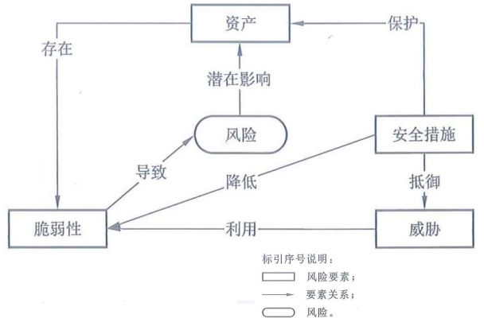

# 课前须知

> 课程主页：[瀚海教学网](https://course.ustc.edu.cn/portal)

- 成绩组成
  > - [x] 期末考试（闭卷，预计第14周左右）
  > - [x] 平时作业（每周交一次，约10次）
  > - [x] 课堂表现

- 各部分所占百分比
  > 根据实际情况综合考虑

# 第一章 绪论

## 计算机及其安全性

### 计算机的概念（略）

$$\text{计算机} \begin{cases}
\text{控制器、运算器} \begin{cases}
\text{A 人工智能(智能)} \newline
\text{B 区块链(信任)} \newline
\text{C 云计算(计算)} \newline
\end{cases} \newline
\text{存储器：D 大数据} \newline
\text{控制器、运算器} \begin{cases}
\text{E 物联网(连接)} \newline
\text{F 信息流(流动)} \newline
\text{G 移动通信(移动)} \newline
\end{cases} \newline
\text{(Q 量子)} \newline
\end{cases}
$$

### 信息安全

#### 信息安全的概念
- [x] 信息安全学关注信息本身的安全
  > - 不丢、不坏、不冒、不泄
  > - 不管是否应用了计算机作为信息处理的手段

- [x] 信息安全的任务是保护信息财产
  > - 防止偶然的或未授权者对信息的恶意泄露、修改和破坏，从而导致信息的不可靠或无法处理等
  > - 最大限度利用信息为我们服务，同时不招致损失或损失最小

- [x] 信息就是数据

$$信息安全 = 数据安全 + 系统安全$$

#### 信息安全的属性(CIA三要素)

- [x] 从 _**消息/数据**_ 的层次来看，包括
  > - _**保密性(Confidentiality，又叫机密性)**_ ，即保证消息不会被非法泄露扩散
  > - _**完整性(Integrity)**_ ，即保证消息的来源、去向、内容真实无误

- [x] 从 _**系统**_ 的层次来看，包括
  > - _**可用性(Availability)**_ ，即保证信息系统随时可用，运行过程中不出现故障，若遇意外打击能够尽量减少并尽早恢复正常

#### 信息安全威胁

  
  

   信息安全威胁
  

#### 信息安全的实现

> 一个完整的信息安全系统至少包含三类措施： _**技术方面的安全措施，管理方面的安全措施和相应的政策法律**_

  
  

   信息网络安全保护系统构架
  

#### 信息安全技术

- [ ] 信息加密
- [ ] 数字签名
- [ ] 数据完整性
- [ ] 身份鉴别
- [ ] 访问控制
- [ ] 安全数据库
- [ ] 网络控制技术
- [ ] 反病毒技术
- [ ] 安全审计
- [ ] 业务填充
- [ ] 路由控制机制
- [ ] 公证机制

#### 信息安全管理

> 信息安全管理主要涉及以下几个方面：人事管理；设备管理；场地管理；存储媒体管理；软件管理；网络管理；密码和密钥管理

#### 信息安全与法律

- [x] 政策上：完备的法律法规和安全标准
- [x] 技术上：计算机网络和信息安全的体系结构

##### 网络安全相关法律法规制度

- [x] 法律体系
  > - **网络安全法**
  > - 国家安全法
  > - **保密法**
  > - 反恐怖主义法
  > - **刑法**
  > - **密码法**
  > - 治安管理处罚法
  > - **数据安全法**
  > - **个人信息保护法**
  > - **反电信网络诈骗法**
  > - 关于加强网络信息保护的决定
  > - 关于维护互联网安全的决定
  > - 互联网信息服务管理办法

- [x] 配套法规
  > - 网络安全 _**等级保护制度**_
  > - 关键信息基础设施的认定和保护办法
  > - 数据跨境传输的安全评估办法
  > - 网络产品和服务的国家安全审查制度

##### 《网络安全法》配套行政法规、部门规章和规范性文件

1. 《儿童个人信息网络保护规定》
2. 《互联网新闻信息服务管理规定》
3. 《区块链信息服务管理规定》
4. 《网络信息内容生态治理规定》
5. 《互联网信息内容管理行政执法程序规定》
6. 《公安机关互联网安全监督检查规定》
7. 《网络产品和服务安全审查办法》(试行)
8. 《互联网跟帖评论服务管理规定》
9. 《互联网论坛社区服务管理规定》
10. 《互联网用户公众账号信息服务管理规定》
11. 《互联网群组信息服务管理规定》
12. 《互联网新闻信息服务新技术新应用安全评估管理规定》
13. 《互联网新闻信息服务单位内容管理从业人员管理办法》
14. 《微博客信息服务管理规定》
15. 《金融信息服务管理规定》
16. 《一流网络安学院建设示范项目管理办法》
17. 《工业控制系统信息安全防护能力评估工作管理办法》
18. 《国家健康医疗大数据标准、安全和服务管理办法(试行)》
19. 《网络安全等级保护测评机构管理办法》
20. 《公安部关于印发《违反<网络安全法>行为名称及适用条款》的通知》
21. 《具有舆论属性或社会动员能力的互联网信息服务安全评估规定》
22. 《网络音视频信息服务管理规定》
23. 《关键信息基础设施安全保护条例（征求意见稿）》
24. 《数据安全管理办法（征求意见稿）》
25. 《网络安全审查办法（征求意见稿）》
26. 《个人信息出境安全评估办法（征求意见稿）》
27. 《网络安全威胁信息发布管理办法（征求意见稿）》
28. 《网络安全等级保护条例（征求意见稿）》
29. 《网络安全漏洞管理规定（征求意见稿）》

## 系统安全的学科领域

### 信息安全内涵演变

$$\text{COMSEC(通信安全)} \rightarrow \text{COMPUSEC(计算机安全)} \rightarrow \text{INFOSEC(信息系统安全)} \rightarrow \text{IA(信息安全保障)} \rightarrow \text{CS/IA(网络空间安全/信息安全保障)}$$

### 网络空间安全学科知识体系的架构

- [x] CSEC2017以计算学科为基础，把网络空间安全学科知识体系划分为八大知识领域

$$\text{网络空间安全学科知识体系} \begin{cases}
\text{人员安全} \newline
\text{社会安全} \newline
\text{组织安全} \newline
\text{系统安全} \newline
\text{连接安全} \newline
\text{软件安全} \newline
\text{数据安全} \newline
\text{组件安全} \newline
\end{cases}
$$

## 系统安全的方法论

### 系统安全的两层含义

- [x] 以 _**系统思维**_ 应对安全问题
- [x] 应对 _**系统所面临**_ 的安全问题

### 系统的描述性定义

- [x] 一个 **系统（System** 是由 **相互作用或相互依赖** 的 **元素或成份** 构成的某种类型的一个 **统一整体** ，其中的元素完整地关联在一起，它们之间的这种关联关系有别于它们与系统外其它元素之间可能存在的关系
  > - 位于 **系统边界内部** 的元素属于系统的 _**组成元素**_
  > - 位于 **系统边界外部** 的元素属于系统的 _**环境**_

### 观察系统的方法

- [x] 自外观察法：
  > - 观察者位于系统之外对系统进行观察
  > > 通常是通过观察系统的输入和输出来分析系统的行为

- [x] 自内观察法：
  > - 观察者位于系统之内对系统进行观察，此时，观察者属于系统的一个组成部分
  > > 通常是通过观察系统的外部环境来分析系统的行为

### 在网络空间中观察系统的环境

- [x] 系统在风险的包围之中，必须具有一定的安全性，才能正常运转
  > 系统的安全性需要以系统化的视野去观察

### 系统研究的方法(重点)

#### 还原法

##### 定义

- [x] 把 _大**系统分解为小系统**_ ，然后通过对小系统的研究去推知大系统的行为(理解为分解法即可)
  > - 把系统分解成它的组成部分，通过对系统的组成部分的研究去了解原有系统的情况

##### 还原论应用示例

- [x] 机械手表的还原：
  > 很多机械零部件

- [x] 人的还原：
  > 头、颈、躯干、四肢

##### 还原中遇到的问题

$$
\text{盐 = 氯化钠 = 氯元素 + 钠元素} \rightarrow 
\begin{cases}
\text{氯元素} \rightarrow \text{剧毒} \newline
\text{钠元素} \rightarrow \text{剧毒} \newline
\end{cases} \rightarrow \text{盐} \rightarrow \text{剧毒(????)} \newline
$$

> **说明还原法中由小系统推导大系统性质不一定正确**

##### 还原中的困惑

- [x] 人的还原方法1：头、颈、躯干、四肢
- [x] 人的还原方法2：皮肤、肌肉、骨骼、内脏、血液循环系统、神经系统
- [x] 问题：爱因斯坦的成就 = ？

> **对于同一个系统存在多个还原方法，同时对于有些系统的还原方法不能确定**

#### 整体法

##### 定义

- [x] 把一个系统看成一个完整的统一体，一个完整的被观察单位，而不是简单的微观组成元素的集合

### 系统的宏观特性

- [x] 整体特性：综合特性、涌现性
  > - [ ] 综合特性：可以分解为系统组成部分的特性(理解为系统的特性可以由组成部分特性传递而来或者系统的特性可以被其组成部分继承得到，即该特性被系统和其组成部分共同所拥有)
  > > 例：盐的重量
  > - [ ] 涌现性：不可还原（即不可分解）为系统组成部分的特性(理解为系统的特性 **不** 可以由组成部分特性传递而来或者系统的特性 **不** 可以被其组成部分继承得到，即该特性 **不** 被系统和其组成部分共同所拥有)
  > > 例：盐的毒性

#### 安全性属于涌现性

- [x] 以操作系统和保密性为例：
  > - [ ] 操作系统的分解：进程管理、内存管理、外设管理、文件管理、处理器管理
  > - [ ] 分析：
  > > - 就算各个子系统都能确保不泄露信息
  > > - 某些子系统的相互作用也可能泄露信息

### 生命周期（Life Cycle）

- [x] 人(自然系统)的一生：
  > 出生、成长、成熟、衰老、死亡

- [x] 计算机(人工系统)的一生：
  > 系统需要、系统分析、系统建模与设计、系统构建与测试、系统使用与老化、系统报废

### 幸福与可信

 - [x] 人(自然系统)幸福与否：
  > 人生各个阶段是否平安顺利

- [x] 人工系统是否值得信赖（可信）：
  > 系统生命周期各阶段的使命的完成是否有保障

### 系统工程（Systems Engineering）

- [x] 系统工程：涵盖系统生命周期的具有关联 _**活动和任务**_ 的技术性和非技术性过程的集合
  > - _技术性过程_ 应用 `工程分析与设计原则` 去建设系统
  > - _非技术性过程_ 通过 `工程管理` 去保障系统建设工程项目的顺利实施

### 系统安全工程（Systems Security Engineering）

- [x] 系统安全工程：把安全性相关活动和任务融合到系统工程的过程之中，形成的一个系统工程专业分支
  > 它力求从系统生命周期的全过程去保障系统的安全性

### 系统安全思维

- [x] 运用整体论思想分析安全问题
- [x] 在系统的全生命周期中衡量系统的安全性
- [x] 通过系统安全工程措施建立和维护系统的安全性

## 安全问题与安全系统

- [x] 安全系统的建设应遵循从 `现实社会需求` 到 `计算技术需求` 的发展过程

### 安全系统建设过程概括

1. 从分析现实安全问题开始
2. 结合现实环境和现实目标，制定现实安全策略
3. 加上计算环境因素，形成安全策略
4. 把安全策略表示成精确的安全模型
5. 根据安全模型设计出便于实现的安全机制
6. 实现安全机制，开发出安全系统

- [x] 计算环境中的概念
  > - 安全策略
  > - 安全模型
  > - 安全机制
  > - 安全系统

- [x] 现实中 `安全问题` 主要以 `安全攻击` 为主要体现

- [x] 在考虑解决办法时，需要考虑 `安全风险` 、 `应对代价` 、 `现有法律` 等因素，它们反映着现实的状况和可利用的条件，这就是 `现实环境`

- [x] 如何采取措施应对安全问题，在很大程度尚取决于受到安全威胁影响的对象，即现实中的社会组织或个人，取决于他们 `期望达到的效果和程度` 或他们追求的安全目标，即 `现实目标`

- [x] 针对现实安全问题，把现实环境和现实目标有机地结合起来，可设计出解决这些问题的办法，这就是 `现实安全策略`

- [x] 在网络空间的系统安全领域，通常说到 `安全策略` ，一般是指计算机安全策略，是信息技术环境中的安全策略，或者说是 `计算环境` 中的安全策略
`  > 现实安全策略是制定安全策略的基础，但往往还 `缺乏信息系统的元素` 

- [x] 在计算环境中，摆在第一位的是丰富、好用的功能，而不是安全性。安全性的实现有时还要以牺牲一定的易用性为代价

- [x] 所以，要 `以现实安全策略为基础` ，权衡 `计算环境` 中的 `功能` 、 `威胁` 、 `代价` 等因素，引入计算环境的特点，制定 `安全策略`

- [x] 为了提高严谨性和科学性，需要把安全策略精确地表示出来。安全策略的 `精确表示` ，或者说形式化表示，称为 `安全模型`

- [x] 为使理论色彩比较浓厚的安全模型的作用能落实到实处，需要为它设计出 `便于在信息系统中实现的形式` ，这种形式称为 `安全机制`

- [x] 必须在网络空间的系统中 `实现一定的安全机制` ，网络空间的系统才有可能称为 `安全系统`

### 讲台上的电脑的安全

- [ ] 物理安全：门卫、门锁、防盗窗等
- [ ] 硬件安全：防火、防水、防尘、防震、
- [ ] 防化学腐蚀；电压稳定；电磁防护等
- [ ] 系统安全：操作系统安全、数据库系统安全等
- [ ] 应用安全：应用软件(C/S→B/S)、OA/MIS/ERP等
- [ ] 网络安全：网络入侵、拒绝服务攻击等
- [ ] 数据安全：防勒索、隐私泄露等
- [ ] 安全管理：制度、机构、人员、建设、运维等

$$三分技术，七分管理$$

$$整体论、安全、代价$$

## 安全管理

- [x] 安全性：人为的故障
  > - 一个人做了不应该做的事情而产生的结果
  > - 安全是一个人为的问题，因此不能仅仅依靠技术来解决，需要借助安全管理和法律法规

- [x] 可靠性(reliability)：意外的故障

- [x] 可用性(usability)：操作错误

- [x] 三分技术，七分管理

### Safety vs. Security

- [x] Safety侧重于对无意造成的事故或事件进行安全保护，可以是加强人员培训、规范操作流程、完善设计等方面的安全防护工作

- [x] Security侧重于对人为地有意地破坏进行保障和保护，如部署安全设备进行防护、加强安全检测等

- [x] 随着信息系统安全向网络空间安全的发展，我们既要考虑人为的故意的针对计算机信息系统的渗透和破坏，也要考虑计算机信息系统的开发人员或使用人员无意的错误

- [x] 因此，本课程不对Security和Safety进行严格区分

### 运用技术提升管理水平

- [ ] 运用数据挖掘技术帮助发现漏洞

- [ ] 运用数据分析技术感知安全态势

- [ ] 运用机器学习技术帮助进行自动防御

### 安全标准

- [x] BS7799/ISO17799：安全管理标准
  > 主要内容有资产分类与控制、物理安全、个人安全、访问控制等

- [x] GB17895-1999《计算机信息系统安全保护等级划分准则》
  > 将信息系统安全分为5个等级：用户自主保护级、系统审计保护级、安全标记保护级、结构化保护级、访问验证保护级

- [x] TCSEC（桔皮书）：为计算机安全产品的评测提供了测试和方法
  > 将安全分为4个方面（安全政策、可说明性、安全保障和文档）和7个安全级别（从低到高依次为D、C1、C2、B1、B2、B3和A级）

#### BS7799/ISO17799

1. 建立有组织的安全策略
2. 组织性安全基础设施
3. 资产分类和控制
4. 物理和环境安全
5. 个人安全
6. 交流和运作管理
7. 访问控制
8. 系统开发和维护
9. 商业持续规划
10. 规范性

### 风险评估
> GB/T 20984-2022 《信息安全技术信息安全风险评估方法》

#### 风险与威胁分析

- [x] `风险=资产×漏洞×威胁`
  > 评定资产价值、漏洞危险程度和威胁可能性之后进行风险计算

- [x] `资产` ：应当是被鉴定和评估过的
  > - IT系统中包括硬件、软件、数据和信息、名誉等
  > - 资产鉴定：等价货币值、重要性

- [x] `漏洞` ：系统的脆弱性，可被利用来破坏资产
  > - 漏洞扫描
  > - 可由他们造成的影响定级（危险级别）
  > - 攻击面：由系统中可到达的和可被利用的脆弱点构成

- [x] `威胁` ：利用漏洞去损坏资产的行为
  > - 可根据对资产造成的损坏对威胁进行分类
  > - 鉴别攻击来源，分析攻击执行的细节
  > - `攻击树` ：定量分析攻击
  > > 形象化、结构化的威胁分析方法
  >
  > - 威胁可根据其可能性来评定，要考虑已有安全措施

- [x] 安全措施：安全措施的实施通过降低资产脆弱性被利用难易程度，抵御外部威胁，以实现对资产的保护

#### 风险要素及其关系

  
  

   风险要素及其关系
  

#### 风险评估实施流程图

  
  

   风险评估实施流程图
  

#### 资产识别

  
  

   资产识别
  

### 攻击面(重点)

- [x] `攻击面` 由系统中可到达的和可被利用的 `脆弱点` 构成。例如：
  > - 对外开放的Web和其他服务器的端口、监听这些端口的代码
  > - 在防火墙内可用的服务
  > - 处理进入内部的数据、电子邮件、XML、办公文档和工业级定制数据交换格式的代码
  > - 界面、SQL和Web表单
  > - 对敏感信息有访问权限的员工，这些敏感数据可能会收到社会工程学的攻击

#### 攻击面分类

- [x] 网络攻击面
  > 企业网、广域网或者局域网中的脆弱点或漏洞，包括网络协议中的脆弱点
  > > 例如：利用这些弱点进行拒绝服务攻击、通信线路破坏和各种不同形式的入侵攻击

- [x] 软件攻击面
  > 应用程序、实用程序或操作系统代码中的漏洞，尤其是指Web服务器软件中的漏洞

- [x] 人为攻击面
  > 员工或外部人员，诸如 `社会工程学` 、人为错误和受信任的内部人员引起的脆弱点

#### 攻击面分析

- [x] `攻击面分析` **是评估系统威胁的规模和严重性有用的技术**

- [x] 对这些脆弱点进行系统的分析可使开发者和安全分析师能够指导哪些安全机制是必需的

- [x] 一旦攻击面被定义出来，设计人员就可能会找到减小攻击面的方法，从而能使敌手的入侵更加困难

- [x] 攻击面也可以为测试、增加安全性方法、修改服务和应用程序等分配优先级提供指导

### 社会工程学

- [x] **社会工程学（Social Engineering，又叫“社交工程学”）**
  > - 利用人的弱点如人的本能反应、好奇心、信任、贪便宜等，进行诸如欺骗、伤害等危害手段，获取自身利益
  > - 黑客米特尼克悔改后在《反欺骗的艺术》中所提出的

- [x] 电信诈骗、网络钓鱼。。。

- [x] “社会工程学是未来10年最大的安全风险，许多破坏力最大的行为是由于社会工程学而不是黑客或破坏行为造成的。

- [x] 在信息安全这个链条中，人的因素是最薄弱的一环节
- [x] 社会工程就是利用人的薄弱点，通过欺骗手段而入侵计算机系统的一种攻击方法
  > 组织可能采取了很周全的技术安全控制措施，例如：身份鉴别系统、防火墙、入侵检测、加密系统等，但由于员工无意当中通过电话或电子邮件泄露机密信息(如系统口令、IP地址)，或被非法人员欺骗而泄露了组织的机密信息，就可能对组织的信息安全造成严重损害
- [x] 社会工程学通常以 ***交谈、欺骗、假冒或口语*** 等方式，从合法用户中套取用户系统的秘密
  > - 熟练的社会工程师都擅长进行信息收集，很多表面上看起来一点用都没有的信息都会被这些人利用起来进行渗透
  > - 比如说一个电话号码、一个人的名字、或者工作的ID号码等

### 攻击树(重点)

#### 相关概念

- [x] `树根` ：一般类的攻击，攻击目标
- [x] `树节点` ：达成攻击所需的 `子目标`
- [x] `叶子节点` ：发起一个攻击的不同方式
- [x] 除了叶子节点外的每一个节点： `与节点(AND-node)` 或者 `或节点(OR-node)`
- [x] 边：赋权值，估算攻击的成本、发生的可能性、成功的可能性等

  
  

   获取用户口令的攻击树
  

#### 关于攻击树

- [x] `攻击树` 是一个分支型的、层次化的数据结构，表示了一系列潜在技术，这些技术可利用安全漏洞进行攻击
- [x] `作为攻击目标的安全事件` 是攻击树的 `根节点` ，攻击者可以迭代地、递增地达到这个目标的途径就是这棵树的分支和子节点
- [x] 每一个 `子节点` 都定义了一个 `子目标` ，每一个子目标都可能有一系列的进一步的子目标，等等
- [x] 从根节点沿着路径向外延伸的最终的节点，也就是 `叶子节点` ，代表了发起一个攻击的不同方式

  
  

   网银认证的攻击树
  

  
  

   网银认证攻击树解释
  

